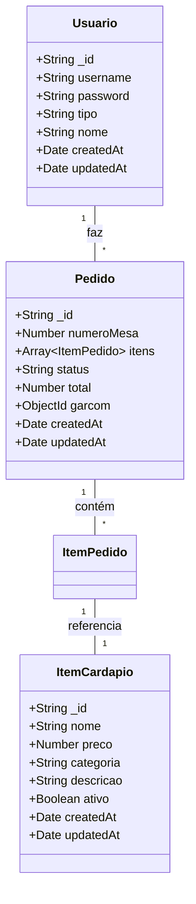
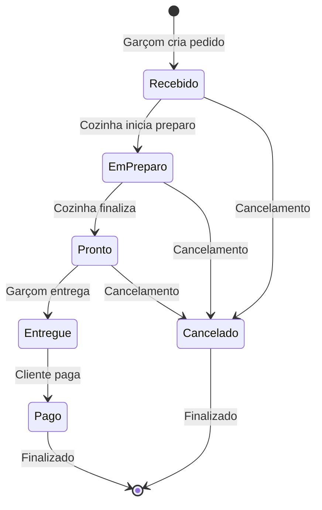

#Link Prototipo

Link Figma: https://www.figma.com/design/dnmssOe5vHav9D2tEn3eb5/Untitled?node-id=0-1&t=8uXmsD69lIgNfr6C-1

# Sistema de Gestão de Pedidos - Pequeno Bistrô Sabor Local


Sistema completo de gestão de pedidos para restaurantes, com módulos especializados para **Gerente**, **Garçom** e **Cozinha**, substituindo processos manuais por automação digital.

## 📋 Índice

- [Visão Geral](#visão-geral)
- [Funcionalidades](#funcionalidades)
- [Tecnologias](#tecnologias)
- [Instalação](#instalação)
- [Uso](#uso)
- [Estrutura do Projeto](#estrutura-do-projeto)
- [Diagramas](#diagramas)
- [API](#api)
- [Modelos de Dados](#modelos-de-dados)
- [Autenticação](#autenticação)
- [Contribuição](#contribuição)

## 🎯 Visão Geral

O **Pequeno Bistrô Sabor Local** é uma plataforma web desenvolvida para otimizar o processo de gestão de pedidos em restaurantes. O sistema substitui métodos manuais baseados em papel por uma solução automatizada que elimina erros e maximiza a eficiência operacional.

### Público-Alvo

- **👨‍💼 Gerente**: Controle total do cardápio, pedidos e faturamento
- **👨‍🍳 Garçom**: Criação e gestão de pedidos em tempo real
- **👨‍🔧 Cozinha**: Visualização e preparo de pedidos por ordem de chegada

## ✨ Funcionalidades

### Módulo Gerente
- 📊 **Dashboard Completo** - Visualização de todos os pedidos e faturamento
- 🍽️ **Gestão de Cardápio** - CRUD completo de itens (criar, editar, excluir)
- 💰 **Cálculo de Faturamento** - Soma automática de pedidos pagos/entregues
- 📈 **Relatórios** - Análise de vendas por período

### Módulo Garçom
- 📋 **Criação de Pedidos** - Interface intuitiva para adicionar itens
- 🏷️ **Gestão por Mesa** - Organização de pedidos por número da mesa
- 🔄 **Carrinho em Tempo Real** - Cálculo automático do total
- 🚀 **Envio para Cozinha** - Integração direta com módulo de cozinha

### Módulo Cozinha
- 🔔 **Pedidos Recebidos** - Lista automática de novos pedidos
- ⏱️ **Ordem de Chegada** - Organização por tempo de recebimento
- 📊 **Status em Tempo Real** - Atualização instantânea de status
- ✅ **Controle de Produção** - Marcar pedidos como "Em Preparo" e "Pronto"

## 🛠️ Tecnologias

### Frontend
- **Next.js 14** - Framework React com App Router
- **TypeScript** - Tipagem estática para maior confiabilidade
- **CSS Modules** - Estilização componentizada e isolada
- **React Hooks** - Gerenciamento de estado moderno

### Backend
- **Next.js API Routes** - API integrada com o frontend
- **Node.js** - Ambiente de execução JavaScript
- **Mongoose** - ODM para MongoDB
- **JWT** - Autenticação por tokens

### Banco de Dados
- **MongoDB** - Banco de dados NoSQL
- **MongoDB Atlas** - Hospedagem em nuvem

### Segurança
- **JWT Tokens** - Autenticação stateless
- **bcrypt** - Criptografia de senhas
- **Middleware de Autorização** - Controle de acesso por perfil

## 🚀 Instalação

### Pré-requisitos
- Node.js 18+
- MongoDB (local ou MongoDB Atlas)
- npm ou yarn

### Passos de Instalação

1. **Clone o repositório**
```bash
git clone https://github.com/seu-usuario/pequeno-bistro.git
cd pequeno-bistro
```

2. **Instale as dependências**
```bash
npm install
```

3. **Configure as variáveis de ambiente**
```bash
cp .env.example .env.local
```

Edite o arquivo `.env.local`:
```env
MONGODB_URI=mongodb://localhost:27017/pequeno-bistro
JWT_SECRET=seu_jwt_secret_super_seguro_aqui
NEXTAUTH_URL=http://localhost:3000
```

4. **Execute o script de inicialização**
```bash
npm run criar-usuarios
```

5. **Inicie o servidor de desenvolvimento**
```bash
npm run dev
```

6. **Acesse a aplicação**
```
http://localhost:3000
```

## 👥 Uso

### Usuários Padrão

O sistema cria automaticamente 3 usuários para teste:

| Usuário | Senha | Tipo | Acesso |
|---------|-------|------|---------|
| `admin` | `123456` | Gerente | Acesso completo |
| `garcom` | `123456` | Garçom | Criação de pedidos |
| `cozinha` | `123456` | Cozinha | Preparação de pedidos |

### Fluxo de Trabalho

1. **Login**: Cada usuário acessa com suas credenciais
2. **Redirecionamento Automático**: O sistema direciona para o módulo correto
3. **Operação**: Realiza as atividades específicas do perfil
4. **Logout**: Encerra a sessão com segurança

## 📁 Estrutura do Projeto

```
pequeno-bistro/
├── app/                    # Next.js App Router
│   ├── api/               # API Routes
│   │   ├── auth/          # Autenticação
│   │   ├── cardapio/      # Gestão do cardápio
│   │   └── pedidos/       # Gestão de pedidos
│   ├── cozinha/           # Módulo cozinha
│   ├── garcom/            # Módulo garçom
│   ├── gerente/           # Módulo gerente
│   ├── login/             # Página de login
│   └── layout.tsx         # Layout principal
├── lib/                   # Utilitários e configurações
│   ├── mongodb.ts         # Conexão com MongoDB
│   ├── auth.ts            # Serviços de autenticação
│   └── scripts/           # Scripts de inicialização
├── models/                # Modelos do MongoDB
│   ├── Usuario.ts
│   ├── Pedido.ts
│   └── ItemCardapio.ts
├── services/              # Lógica de negócio
├── controllers/           # Controladores da API
├── middleware.ts          # Middleware de autenticação
└── public/                # Arquivos estáticos
```

## 📊 Diagramas

### Diagrama de Classes



### Diagrama de Estados do Pedido



## 🔌 API

### Autenticação

| Método | Endpoint | Descrição |
|--------|----------|-----------|
| `POST` | `/api/auth/login` | Login de usuário |
| `POST` | `/api/auth/logout` | Logout do sistema |

### Cardápio

| Método | Endpoint | Descrição | Permissão |
|--------|----------|-----------|-----------|
| `GET` | `/api/cardapio` | Listar itens | Todos |
| `POST` | `/api/cardapio` | Criar item | Gerente |
| `PATCH` | `/api/cardapio/[id]` | Atualizar item | Gerente |
| `DELETE` | `/api/cardapio/[id]` | Excluir item | Gerente |

### Pedidos

| Método | Endpoint | Descrição | Permissão |
|--------|----------|-----------|-----------|
| `GET` | `/api/pedidos` | Todos os pedidos | Gerente |
| `GET` | `/api/pedidos/cozinha` | Pedidos para cozinha | Cozinha |
| `POST` | `/api/pedidos` | Criar pedido | Garçom |
| `PATCH` | `/api/pedidos/[id]` | Atualizar status | Cozinha/Gerente |

### Exemplo de Uso da API

**Criar Pedido:**
```javascript
const response = await fetch('/api/pedidos', {
  method: 'POST',
  headers: {
    'Content-Type': 'application/json',
    'Authorization': `Bearer ${token}`
  },
  body: JSON.stringify({
    numeroMesa: 5,
    itens: [
      {
        item: "507f1f77bcf86cd799439011",
        quantidade: 2,
        precoUnitario: 25.90
      }
    ],
    garcom: "507f1f77bcf86cd799439012"
  })
});
```

## 🗃️ Modelos de Dados

### Usuario
```typescript
interface Usuario {
  _id: string;
  username: string;      // Único, para login
  password: string;      // Hash bcrypt
  tipo: 'gerente' | 'garcom' | 'cozinha';
  nome: string;          // Nome completo
  createdAt: Date;
  updatedAt: Date;
}
```

### ItemCardapio
```typescript
interface ItemCardapio {
  _id: string;
  nome: string;          // Nome do item
  preco: number;         // Preço em R$
  categoria: string;     // Categoria do item
  descricao?: string;    // Descrição opcional
  ativo: boolean;        // Controle de disponibilidade
  createdAt: Date;
  updatedAt: Date;
}
```

### Pedido
```typescript
interface Pedido {
  _id: string;
  numeroMesa: number;    // Número da mesa (1-50)
  itens: ItemPedido[];   // Array de itens do pedido
  status: 'Recebido' | 'Em Preparo' | 'Pronto' | 'Entregue' | 'Pago' | 'Cancelado';
  total: number;         // Calculado automaticamente
  garcom: string;        // ID do usuário garçom
  createdAt: Date;
  updatedAt: Date;
}
```

## 🔒 Autenticação

### Sistema de Permissões

| Tipo | Cardápio | Pedidos | Faturamento |
|------|----------|---------|-------------|
| **Gerente** | CRUD Completo | Leitura Total | Leitura/Cálculo |
| **Garçom** | Leitura | Criação | - |
| **Cozinha** | - | Leitura/Atualização | - |

### Middleware de Proteção
O sistema utiliza middleware para proteger rotas baseado no tipo de usuário:

```typescript
// middleware.ts
export function middleware(request: NextRequest) {
  // Verifica token e redireciona para módulo específico
  // Exemplo: usuário 'garcom' → /garcom
}
```

## 🚀 Deploy

### Deploy na Vercel

1. **Configure as variáveis de ambiente na Vercel:**
   - `MONGODB_URI`
   - `JWT_SECRET`
   - `NEXTAUTH_URL`

2. **Deploy automático:**
```bash
npm run build
vercel --prod
```

### Deploy Manual

1. **Build do projeto:**
```bash
npm run build
```

2. **Execute em produção:**
```bash
npm start
```

## 🤝 Contribuição

Contribuições são bem-vindas! Para contribuir:

1. Faça um fork do projeto
2. Crie uma branch para sua feature (`git checkout -b feature/AmazingFeature`)
3. Commit suas mudanças (`git commit -m 'Add some AmazingFeature'`)
4. Push para a branch (`git push origin feature/AmazingFeature`)
5. Abra um Pull Request

### Padrões de Código

- Siga as convenções do TypeScript
- Mantenha a consistência com o estilo existente
- Adicione testes para novas funcionalidades
- Atualize a documentação conforme necessário

## 📄 Licença

Este projeto está sob a licença MIT. Veja o arquivo [LICENSE](LICENSE) para detalhes.

## 🆘 Suporte

Se você encontrar problemas ou tiver dúvidas:

1. Verifique a [documentação online]()
2. Abra uma [issue]() no GitHub
3. Entre em contato com a equipe de desenvolvimento

---
